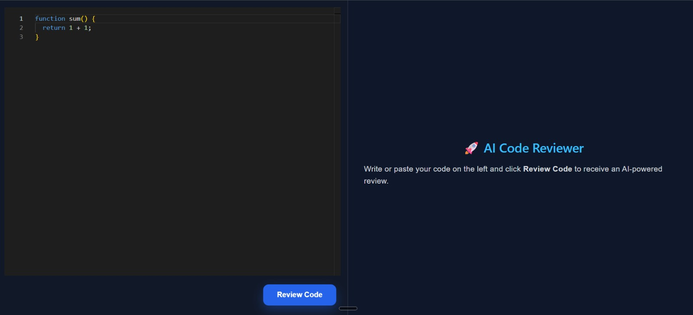
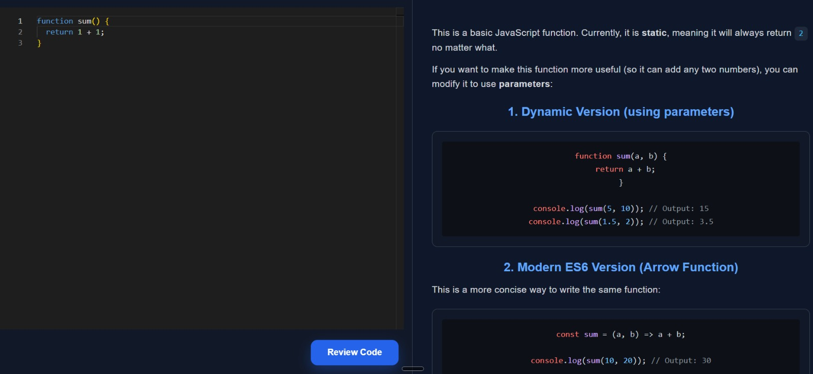
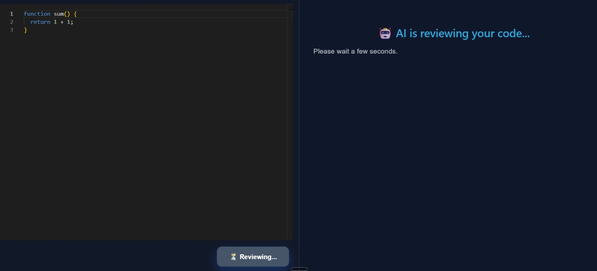

# 🤖 AI Code Reviewer

> An AI-powered Code Review Platform built with **React**, **Node.js**, **Express**, and **Google Gemini AI** that analyzes source code and provides professional feedback, best practices, security recommendations, and performance improvements.

<p align="center">


</p>

---

# 📌 Project Overview

AI Code Reviewer is a full-stack web application that helps developers review their source code instantly using Google's Gemini AI.

Users can write or paste their code into an interactive editor and receive an AI-generated review covering:

- ✅ Code Quality
- ⚡ Performance Optimization
- 🔒 Security Issues
- 📖 Readability
- 🏗 Best Practices
- 🧹 Code Refactoring
- 💡 Better Approaches

The goal of this project is to reduce manual code review time while helping developers write cleaner, more maintainable, and production-ready code.

---

# ❓ Problem Statement

Code reviews are an essential part of software development.

However,

- Manual reviews take time.
- Beginners often don't know what mistakes they are making.
- Hiring experienced reviewers is expensive.
- Developers need quick feedback while learning.

This project solves these problems by using **Generative AI** to provide instant, intelligent, and structured code reviews.

---

# ✨ Features

- 🤖 AI-powered code review using Google Gemini
- 📝 Monaco Code Editor
- 🌈 Syntax Highlighting
- 📄 Markdown-based AI responses
- 🎨 Beautiful responsive UI
- ⚡ Fast review generation
- 📚 Code improvement suggestions
- 🔍 Security recommendations
- 🚀 Performance optimization tips
- 📱 Responsive design

---

# 🛠 Tech Stack

## Frontend

- React.js
- Monaco Editor
- Axios
- React Markdown
- Rehype Highlight
- CSS3

## Backend

- Node.js
- Express.js
- Google Gemini API
- dotenv

## Development Tools

- VS Code
- Git
- GitHub
- Postman

---

# 🏗 Project Architecture

```
                    User
                      │
                      │
                      ▼
           Monaco Code Editor
                      │
                      ▼
               React Frontend
                      │
             Axios HTTP Request
                      │
                      ▼
               Express Backend
                      │
                      ▼
          Google Gemini AI API
                      │
                      ▼
          AI Code Review Response
                      │
                      ▼
       Markdown + Syntax Highlighting
                      │
                      ▼
                 User Interface
```

---

# 📷 Screenshots

## 🏠 Home Page



---

## 🤖 AI Review



---

## 🏗️ Architecture


```

---

# 📂 Project Structure

```
AI-Code-Reviewer
│
├── Backend
│   ├── src
│   │   ├── controllers
│   │   ├── routes
│   │   ├── services
│   │   └── app.js
│   │
│   ├── server.js
│   ├── package.json
│   └── .env
│
├── Frontend
│   ├── src
│   │   ├── assets
│   │   ├── App.jsx
│   │   ├── App.css
│   │   └── main.jsx
│   │
│   ├── public
│   ├── package.json
│   └── vite.config.js
│
├── images
│   ├── home.png
│   ├── review.png
│   └── architecture.png
│
├── .gitignore
└── README.md
```

---

# 🚀 Installation

## Clone Repository

```bash
git clone https://github.com/Sandip-khirpai/AI-Code-Reviewer.git
```

---

## Backend Setup

```bash
cd Backend

npm install
```

Create a `.env` file inside **Backend**

```env
GEMINI_API_KEY=YOUR_API_KEY
```

Run Backend

```bash
npm start
```

or

```bash
npx nodemon
```

---

## Frontend Setup

```bash
cd Frontend

npm install

npm run dev
```

Application will start at

```
http://localhost:5173
```

Backend

```
http://localhost:3000
```

---

# 🔌 API Endpoint

## Review Code

```
POST /ai/get-review
```

### Request

```json
{
    "code":"function sum(){ return 1+1 }"
}
```

### Response

Markdown formatted AI review

---

# 🎯 How It Works

1. User writes code inside Monaco Editor.
2. React sends the code to Express API.
3. Express forwards the prompt to Google Gemini.
4. Gemini analyzes the code.
5. AI returns a professional markdown review.
6. React renders the review with syntax highlighting.

---

# 🚀 Future Improvements

- 🔐 User Authentication
- 👤 User Dashboard
- 📚 Review History
- 📥 Download Review as PDF
- 🌙 Dark / Light Theme
- 🌍 Multi-language Support
- 💬 AI Chat Assistant
- 📊 Code Quality Score
- 📈 Complexity Analysis
- ☁ Deployment
- ⭐ Favorite Reviews
- 🔎 Search Previous Reviews

---

# 📊 Results

The project successfully demonstrates the practical integration of **Generative AI** into software development workflows.

Key achievements include:

- AI-powered code review
- Professional markdown rendering
- Syntax highlighted suggestions
- Interactive code editor
- Responsive interface
- Clean backend architecture

---

# 📖 Learning Outcomes

This project helped me gain hands-on experience with:

- React.js
- Node.js
- Express.js
- REST APIs
- Prompt Engineering
- Google Gemini API
- Markdown Rendering
- Syntax Highlighting
- State Management
- Full Stack Development
- Git & GitHub

---

# 🤝 Contributing

Contributions are welcome!

1. Fork the repository

2. Create a new branch

```bash
git checkout -b feature-name
```

3. Commit your changes

```bash
git commit -m "Added new feature"
```

4. Push

```bash
git push origin feature-name
```

5. Open a Pull Request

---

# 👨‍💻 Author

## Sandip Malik

**B.Tech (Computer Science & Engineering)**

Jadavpur University

### GitHub

https://github.com/Sandip-khirpai

### LinkedIn

https://www.linkedin.com/in/sandip-malik-3bb590296/

---

# ⭐ Support

If you found this project helpful,

please consider giving it a ⭐ on GitHub.

It motivates me to build more useful projects.

---

## 📄 License

This project is licensed under the MIT License.